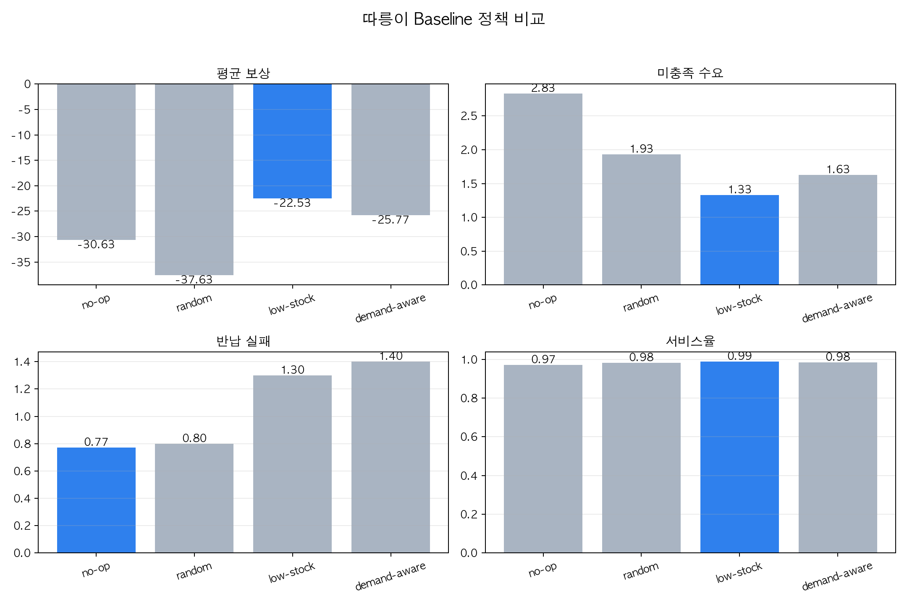
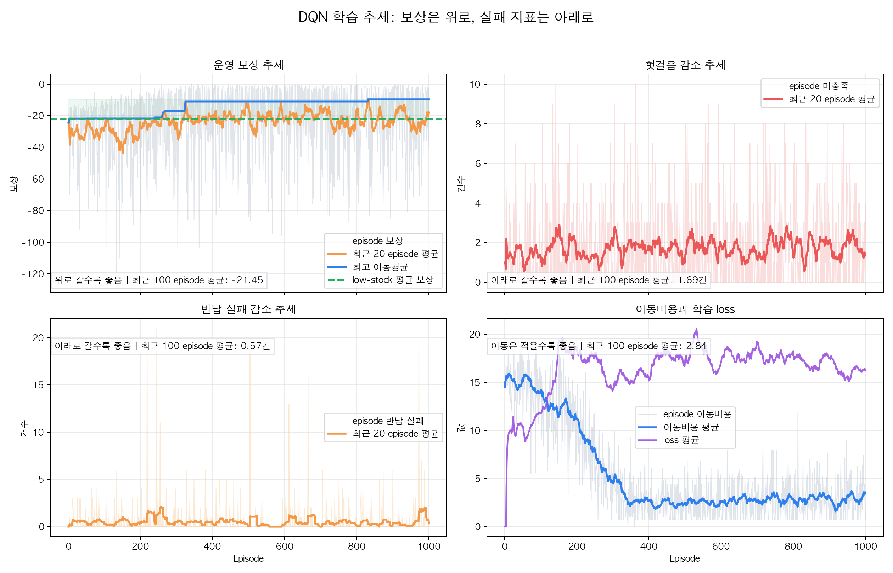
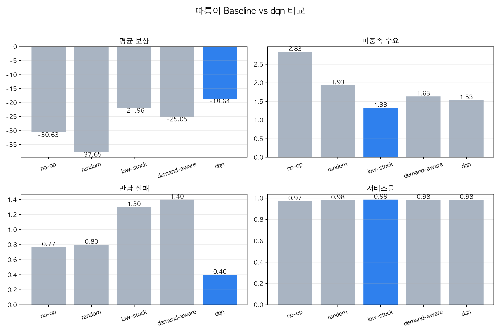

# 따릉이 재배치 강화학습 프로젝트


서울시 공공자전거 **따릉이**의 대여소별 자전거 부족/과잉 문제를 강화학습으로 단순화해 실험하는 프로젝트다.

> **핵심 질문**
> 현재 재고, 예상 수요, 트럭 위치를 보고 **다음에 방문할 대여소를 잘 고르면 시민의 헛걸음을 줄일 수 있을까?**

현재 버전은 전체 서울시를 바로 풀지 않고, **마곡 3개 대여소 + 트럭 1대 + 하루 24 step**으로 작게 시작한다. 목표는 복잡한 구현보다 **State, Action, Reward, Environment를 내가 설명할 수 있는 강화학습 실험**으로 만드는 것이다.

---

## 1. 문제 정의

따릉이 대여소는 시간대에 따라 다음 두 가지 실패가 발생한다.

| 실패 상황 | 의미 | 사용자 경험 |
|---|---|---|
| **대여 실패, stockout** | 빌리려는 사람이 왔는데 자전거가 없음 | 다른 교통수단을 찾아야 함 |
| **반납 실패, full** | 반납하려는 사람이 왔는데 대여소가 가득 참 | 다른 대여소를 찾아 이동해야 함 |

이 프로젝트의 agent는 **재배치 트럭**이다. 트럭은 매 step마다 다음에 갈 대여소를 선택하고, 환경은 해당 시간대의 대여/반납 수요를 처리한다.

```text
공공데이터 CSV
  -> 날짜/시간/대여소별 대여·반납 profile
  -> 따릉이 MDP 환경
  -> baseline 정책과 DQN 정책 비교
```

---

## 2. MDP 설계

| 요소 | 현재 구현 |
|---|---|
| **State** | `station_bikes`, `expected_demand`, `truck_location`, `truck_bikes`, `time_step` |
| **Action** | 다음 step에서 트럭이 방문할 대여소 index 선택 |
| **Reward** | 대여 실패, 반납 실패, 이동 비용을 모두 벌점으로 계산 |
| **Environment** | 마곡 3개 대여소, 트럭 1대, 하루 24 step simulator |
| **Episode** | 실제 날짜 하루를 하나의 episode로 사용 |
| **Goal** | 누적 실패량을 줄이고 service rate를 높이는 정책 학습 |

### State

| State 항목 | 설명 |
|---|---|
| `station_bikes` | 각 대여소에 현재 남아 있는 자전거 수 |
| `expected_demand` | 현재 날짜/시간대에 각 대여소에서 예상되는 대여 수요 |
| `truck_location` | 트럭이 현재 위치한 대여소 |
| `truck_bikes` | 트럭에 실려 있는 자전거 수 |
| `time_step` | 하루 24시간 중 현재 step |

`expected_demand`를 state에 포함한 이유는 agent가 단순히 **현재 비어 있는 대여소**만 보는 것이 아니라, **곧 수요가 발생할 대여소**를 보고 선제적으로 이동할 수 있게 하기 위해서다.

### Action

현재 action은 단순하게 유지한다.

```text
action = 다음에 방문할 대여소 번호
```

예를 들어 대여소가 3개라면 action space는 다음과 같다.

| Action | 의미 |
|---|---|
| `0` | 0번 대여소 방문 |
| `1` | 1번 대여소 방문 |
| `2` | 2번 대여소 방문 |

적재/하차 수량은 아직 agent가 직접 고르지 않고, 환경 내부의 단순 규칙으로 자동 처리한다. 이렇게 해야 DQN이 처음부터 너무 큰 action space를 다루지 않아도 된다.

### Reward

현재 reward는 아래 식으로 계산한다.

```text
reward = stockout_penalty + full_penalty + movement_penalty
```

구체적으로는 다음과 같다.

```text
reward =
  -10 * unmet_demand
  - 3 * rejected_returns
  - 1 * movement_cost
```

| 항목 | 식 | 의미 |
|---|---|---|
| **대여 실패 벌점** | `-10 * unmet_demand` | 자전거가 없어 빌리지 못한 수요를 강하게 벌점화 |
| **반납 실패 벌점** | `-3 * rejected_returns` | 대여소가 가득 차 반납하지 못한 수요를 벌점화 |
| **이동 비용** | `-movement_cost` | 트럭이 불필요하게 많이 이동하는 것을 방지 |

> **왜 대여 실패 벌점이 더 큰가?**
> 대여 실패는 시민이 바로 이동수단을 잃는 상황이므로, 반납 실패보다 더 큰 사용자 손실로 보았다.

---

## 3. 현재 실험 결과

아래 결과는 `outputs/data/magok_3station_daily_profile.json`을 사용해 **30개 날짜**에서 평가한 값이다.

| Policy | Avg Reward | Avg Unmet Demand | Avg Rejected Returns | Service Rate |
|---|---:|---:|---:|---:|
| no-op | -30.63 | 2.83 | 0.77 | 0.972 |
| random | -37.63 | 1.93 | 0.80 | 0.982 |
| low-stock | -22.53 | 1.33 | 1.30 | **0.988** |
| demand-aware | -25.77 | 1.63 | 1.40 | 0.985 |
| **DQN** | **-17.53** | **1.33** | **0.50** | 0.986 |

현재 결과만 보면 DQN은 `low-stock` baseline과 미충족 수요는 비슷하지만, **반납 실패를 더 적게 만들면서 reward가 가장 좋게 나왔다.**

### 결과 그래프

**Baseline 정책 비교**



**DQN 학습 곡선**



**DQN vs baseline 비교**



실행 후 생성되는 주요 그래프는 다음 위치에 저장된다.

| 산출물 | 파일 |
|---|---|
| Baseline 비교 그래프 | `outputs/figures/baseline_comparison.png` |
| DQN 학습 곡선 | `outputs/figures/dqn_training_curve.png` |
| DQN vs baseline 비교 | `outputs/figures/dqn_vs_baseline_comparison.png` |
| DQN parameter/result log | `outputs/experiments/dqn_runs.jsonl` |

> **주의**
> 현재 수치는 작은 3개 대여소 실험 결과다. 전체 따릉이 시스템의 최종 성능으로 해석하면 안 되고, MDP 설계와 학습 흐름을 검증하는 v0 결과로 보는 것이 맞다.

---

## 4. 실행 방법

설치:

```bash
python -m pip install -e ".[dev]"
```

메뉴 실행:

```bash
ddareungi
```

메뉴:

```text
1. Baseline 평가
2. DQN 학습/평가
3. Double DQN 학습/평가
4. Dueling DQN 학습/평가
5. 데이터 profile 상태/생성 안내
6. DQN multi-seed 평가
7. 알고리즘 결과 비교
0. 종료
```

학습/평가 메뉴는 `outputs/data/magok_3station_daily_profile.json`을 우선 사용한다. 이 파일이 없으면 `outputs/data/magok_3station_profile.json`을 사용한다. 둘 다 없으면 메뉴 `5`번에서 profile 생성 명령을 확인한다.

---

## 5. 실제 데이터 profile 만들기

대용량 공공데이터 CSV는 학습 때마다 직접 읽지 않는다. 먼저 1월~12월 대여이력 CSV를 시간대별 profile JSON으로 전처리한 뒤, baseline과 DQN 평가에서 사용한다.

날짜별 daily profile 생성 예시:

```bash
ddareungi-build-profile \
  --rental-dir "data/서울특별시 공공자전거 대여이력 정보_2025" \
  --station-keyword "마곡" \
  --station-count 3 \
  --profile-kind daily \
  --max-sample-high 10 \
  --output outputs/data/magok_3station_daily_profile.json
```

`daily` profile은 다음 구조를 가진다.

```text
날짜 -> 시간 -> 대여소별 대여/반납 count
```

공공데이터의 실제 count는 현재 toy simulator의 용량보다 훨씬 클 수 있다. 그래서 현재는 전체 날짜/시간/대여소 중 가장 큰 count를 `--max-sample-high` 값에 맞추는 max 정규화를 적용한다.

예를 들어 원본 최대값이 `10`이고 `--max-sample-high 5`이면:

```text
원본:   [10, 8, 6]
정규화: [5, 4, 3]
```

모든 값을 같은 비율로 줄이기 때문에 시간대별 상대적인 수요 패턴은 유지된다.

---

## 6. 프로젝트 구조

```text
src/ddareungi_rl/
  env.py             # MDP 환경
  config_loader.py   # YAML/JSON 설정 로더
  baselines.py       # no-op, random, low-stock, demand-aware 정책
  dqn.py             # 기존 import 호환용 DQN API
  data_profile.py    # 실제 데이터 profile 읽기
  profile_builder.py # 공공데이터 CSV에서 profile 생성
  visualization.py   # 실험 결과 그래프 저장
  experiment_log.py  # DQN parameter/result log 저장
  dashboard.py       # 실험 결과 HTML dashboard 생성
  cli.py             # 실행 메뉴

src/ddareungi_rl/algorithms/
  common.py          # 공통 config, policy, 평가 helper
  dqn.py             # 기본 DQN 학습 코드
  double_dqn.py      # Double DQN 학습 코드
  dueling_dqn.py     # Dueling DQN 학습 코드
  networks.py        # QNetwork, DuelingQNetwork

config/
  default_env.yaml   # 환경 크기, 초기 재고, reward 계수, 기본 sample path

sample_data/
  toy_demand_return.json
```

---

## 7. 참고 연구

이 프로젝트는 아래 연구들의 문제의식과 실험 구성을 참고한다.

> 자전거 재배치 문제는 시간과 공간에 따라 수요가 달라지는 **spatio-temporal imbalance** 문제이며, 일반적으로 customer loss, unmet demand, availability failure, 운영 비용을 줄이는 방향으로 평가된다.

- [Dynamic Bike Reposition: A Spatio-Temporal Reinforcement Learning Approach](https://www.kdd.org/kdd2018/accepted-papers/view/dynamic-bike-reposition-a-spatio-temporal-reinforcement-learning-approach)
  자전거 재배치를 장기 customer loss를 줄이는 강화학습 문제로 구성하고, 실제 Citi Bike 데이터 기반 simulator에서 평가한다.
- [Rebalance Bike-Sharing System With Deep Sequential Learning](https://www.microsoft.com/en-us/research/publication/rebalance-bike-sharing-system-with-deep-sequential-learning/)
  빈 대여소와 가득 찬 대여소가 사용자 경험을 악화시키며, 과거 문제 instance에서 미래 재배치 지식을 학습할 수 있다고 설명한다.
- [DeepBike: A Deep Reinforcement Learning Based Model for Large-scale Online Bike Share Rebalancing](https://www.researchgate.net/publication/378732656_DeepBike_A_Deep_Reinforcement_Learning_Based_Model_for_Large-scale_Online_Bike_Share_Rebalancing)
  DQN이 차량 상태, 대여소 상태, 예측 수요를 입력으로 받아 재배치 action의 장기 가치를 추정한다.
- [Fully Dynamic Rebalancing in Dockless Bike-Sharing Systems via Deep Reinforcement Learning](https://arxiv.org/abs/2605.14501)
  단일 트럭의 실시간 이동과 pick-up/drop-off를 MDP로 구성하고 availability failure 감소를 핵심 성과로 본다.
- [Dynamic repositioning in bike-sharing systems with uncertain demand](https://www.sciencedirect.com/science/article/abs/pii/S0305048324000148)
  확률적 수요 아래에서 서비스 품질과 운영 비용의 trade-off를 함께 고려한다.

---

## 8. Roadmap

| 단계 | 목표 | 상태 |
|---|---|---|
| v0 | 마곡 3개 대여소 daily profile 연결 | 진행 중 |
| v1 | baseline vs DQN 결과 안정화 | 진행 중 |
| v2 | seed별 평균/표준편차 평가 추가 | 진행 중 |
| v3 | action distribution, 대표 episode 분석 추가 | 진행 중 |
| v4 | Double DQN, Dueling DQN 비교 | 진행 중 |
| v5 | 더 큰 권역과 실제 거리 기반 이동 비용 적용 | 예정 |
